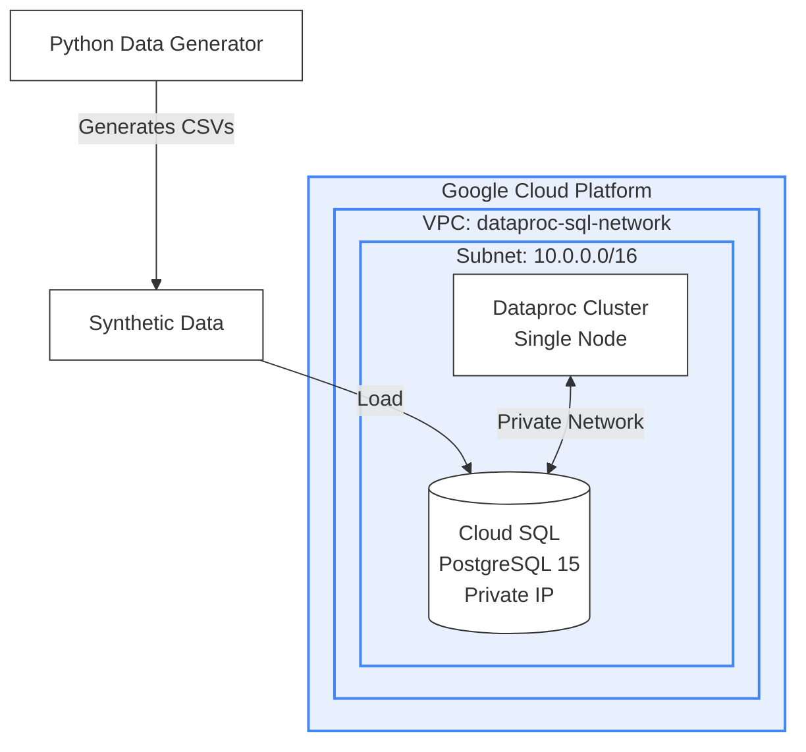

# Hospital Management System - High-Level Architecture

## Executive Summary
This document outlines the high-level architecture for the Hospital Management System on Google Cloud Platform (GCP). The solution is designed to securely manage hospital data, including patients, providers, encounters, and financial transactions, while providing a scalable foundation for data processing and analytics.

## Business Goals
*   **Centralized Data Management**: Consolidate data from multiple hospitals into a single, secure repository.
*   **Scalable Infrastructure**: Leverage cloud-native resources that can grow with data volume.
*   **Cost-Efficiency**: Utilize cost-effective compute and storage options suitable for development and testing phases.
*   **Data Privacy**: Ensure patient data is protected through private networking and access controls.

## System Overview

The system is composed of three main layers:
1.  **Infrastructure Layer**: The foundational cloud resources.
2.  **Data Layer**: The storage and schema for hospital operations.
3.  **Application & Processing Layer**: Tools for data generation and processing.

### Architecture Diagram

### 1. Infrastructure Layer (Google Cloud Platform)
We utilize a **Virtual Private Cloud (VPC)** to create a secure, isolated network environment.
*   **Network Security**: All resources are deployed within a private network (`dataproc-sql-network`), ensuring no direct exposure to the public internet.
*   **Compute Resources**: We use **Google Cloud Dataproc**, a managed service for processing large datasets, configured as a single-node cluster to optimize costs for current workloads.

### 2. Data Layer (Cloud SQL)
Our core operational data resides in **Google Cloud SQL (PostgreSQL)**.
*   **Database Engine**: PostgreSQL 15, a robust and open-source relational database.
*   **Storage**: Configured with HDD storage to balance performance and cost.
*   **Connectivity**: The database is accessible only via private IP within our secure network, enhancing security.

#### Data Model
The database is structured to support comprehensive hospital management:
*   **Hospitals & Departments**: Organizational structure.
*   **Providers**: Medical staff and their specializations.
*   **Patients**: Demographics and personal information.
*   **Encounters**: Patient visits, including types and dates.
*   **Transactions**: Financial records, including billing, insurance claims, and payments.

### 3. Application & Processing Layer
*   **Data Generation**: A custom Python-based engine generates realistic synthetic data (patients, transactions, etc.) to simulate real-world scenarios for testing and development.
*   **Database Management**: Automated scripts handle the initialization and schema management of the database, ensuring consistent deployments.

## Security & Compliance
*   **Private Networking**: Communication between the processing cluster and the database occurs strictly over a private internal network.
*   **Access Control**: Strict identity and access management (IAM) policies control who can deploy resources and access data.
*   **Data Protection**: The architecture is designed with "Security First" principles, disabling public IP addresses for sensitive data stores.

## Future Roadmap
*   **Analytics Dashboard**: Integrate Business Intelligence (BI) tools for real-time reporting.
*   **High Availability**: Upgrade database and compute clusters to multi-zone configurations for production resilience.
*   **Automated Pipelines**: Implement continuous data ingestion pipelines for real-time data updates.
